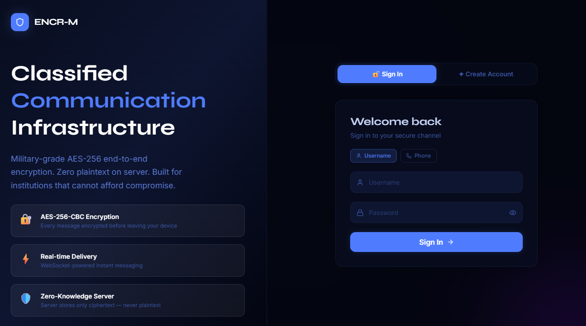
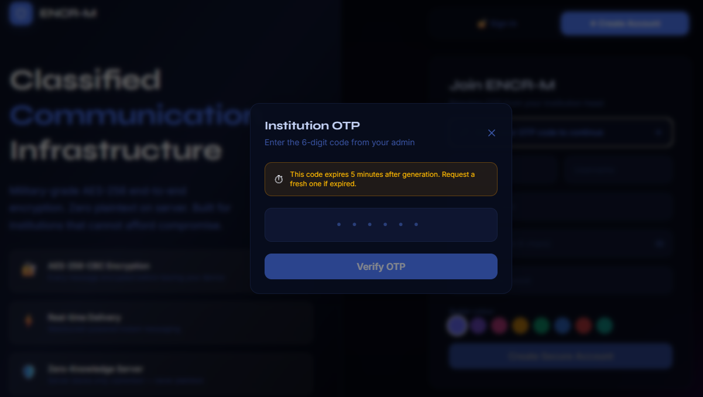
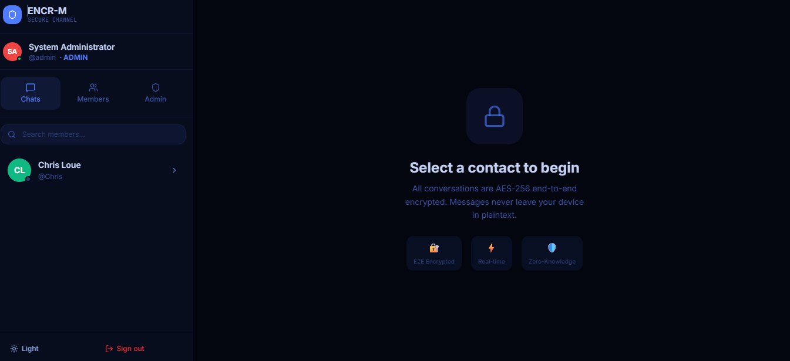
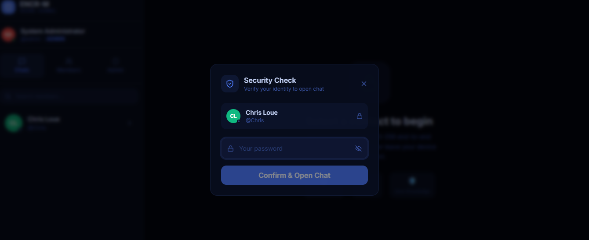
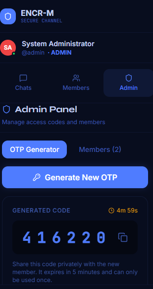
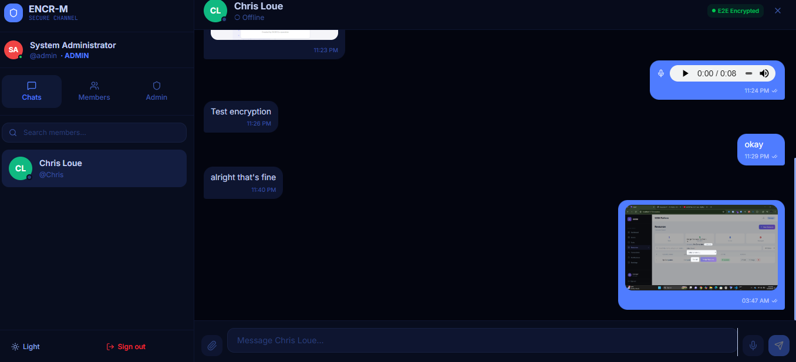

# ENCR-M — Encrypted Government Messaging Platform

## Stack
- **Frontend:** React + Vite + TailwindCSS + Lucide React
- **Backend:** FastAPI (Python) + WebSockets
- **Storage:** JSON files (no database)
- **Encryption:** AES-256-CBC (CryptoJS) — true E2E

---

##  Screenshots

### Login


### OTPRegister


### Chat Interface


### Opening Chat Verification


### OTP Generating


### Chat Features


## Quick Start

### Backend

Terminal command to start with
cd backend
pip install -r requirements.txt
uvicorn main:app --reload --port 8000
```

### Frontend
Terminal command to start with
cd frontend
npm install
npm run dev
```

Open: http://localhost:5173

---

## Default Admin Credentials
- **Username:** `admin`
- **Password:** `Admin@1234`
> Change this immediately in production!

---

## How E2E Encryption Works

1. When User A opens a chat with User B, a **shared AES-256 key** is derived from both user IDs using SHA-256.
2. Before sending, the message is encrypted: `AES.encrypt(plaintext, sharedKey, randomIV)`
3. The server receives and stores **only the ciphertext + IV** — never plaintext.
4. User B's browser derives the same key and decrypts: `AES.decrypt(ciphertext, sharedKey, IV)`
5. **Check it yourself:** Open DevTools - Network - any `/api/messages` response - you'll see only `encrypted_body` (base64 ciphertext) and `iv`.

---

## Security Features
| Feature | Implementation |
|---|---|
| E2E Encryption | AES-256-CBC, key derived client-side |
| Password hashing | bcrypt |
| Session timeout | JWT 20-min expiry + idle timer |
| OTP sign-up gate | 6-digit, 5-min expiry, single-use |
| 2-layer chat auth | Password re-entry before opening any chat |
| Real-time | WebSocket per user |
| Typing indicator | WebSocket typing events |

## Note
 No Status Uploading Feature

---

## File Structure
```
encr-m/
├── backend/
│   ├── main.py           ← FastAPI app + WebSocket manager
│   ├── db.py             ← JSON file database helpers
│   ├── auth_utils.py     ← JWT + bcrypt
│   ├── requirements.txt
│   ├── data/             ← JSON files (auto-created)
│   │   ├── users.json
│   │   ├── messages.json
│   │   └── otps.json
│   └── routers/
│       ├── auth.py       ← Login, signup, OTP verify, pwd check
│       ├── admin.py      ← OTP generation, user management
│       ├── users.py      ← Contact list
│       ├── messages.py   ← Send/edit/delete encrypted messages
│       └── media.py      ← File/image/voice/video upload
└── frontend/
    └── src/
        ├── pages/
        │   ├── AuthPage.jsx   ← Login + Signup with OTP modal
        │   └── ChatPage.jsx   ← Main chat interface
        ├── components/
        │   ├── ChatWindow.jsx    ← Full chat UI + composer
        │   ├── MessageBubble.jsx ← Message rendering
        │   ├── AdminPanel.jsx    ← OTP gen + user management
        │   ├── PasswordGate.jsx  ← Bitwarden-style 2nd auth
        │   └── Avatar.jsx        ← User avatar
        ├── context/
        │   ├── AuthContext.jsx   ← Session + auto-logout
        │   └── ThemeContext.jsx  ← Dark/light mode
        ├── hooks/
        │   └── useSocket.js      ← WebSocket hook
        └── utils/
            ├── crypto.js         ← AES-256-CBC E2E encryption
            └── api.js            ← Axios client + token injection
```